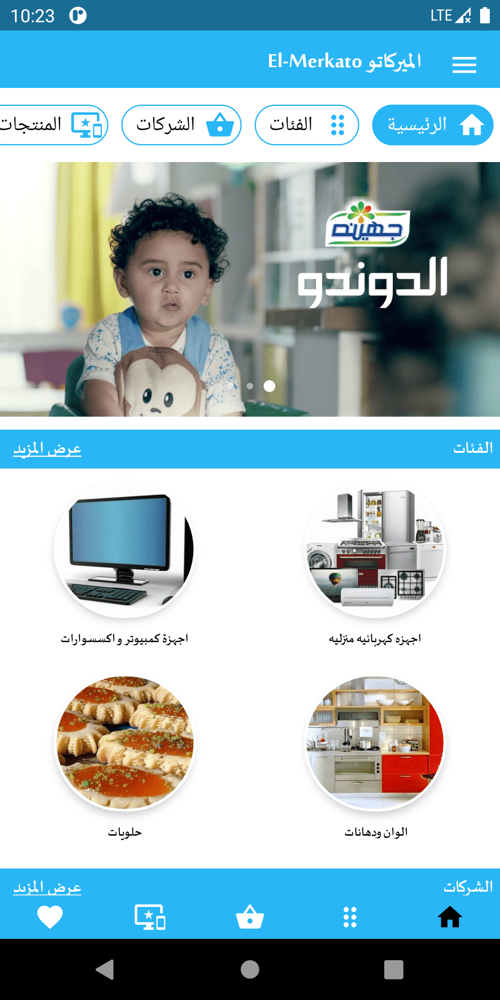
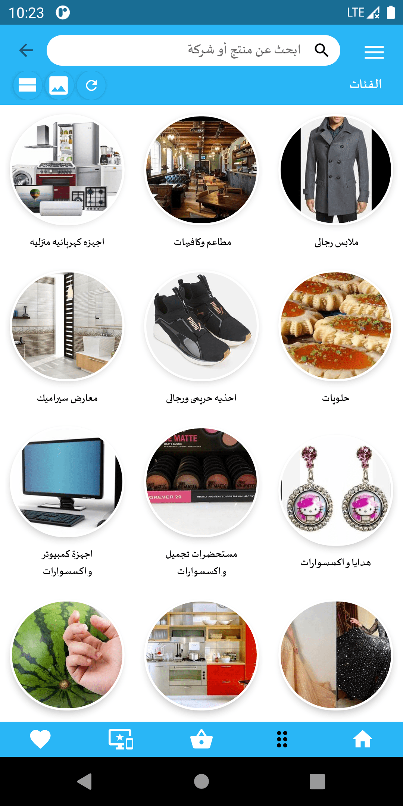
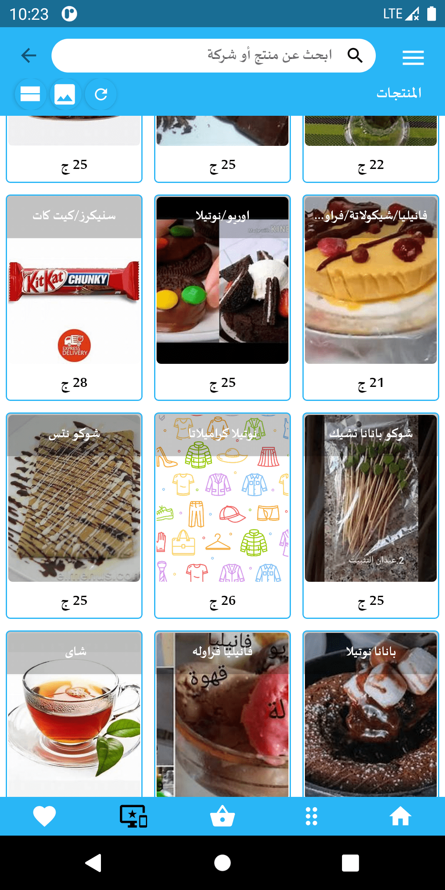
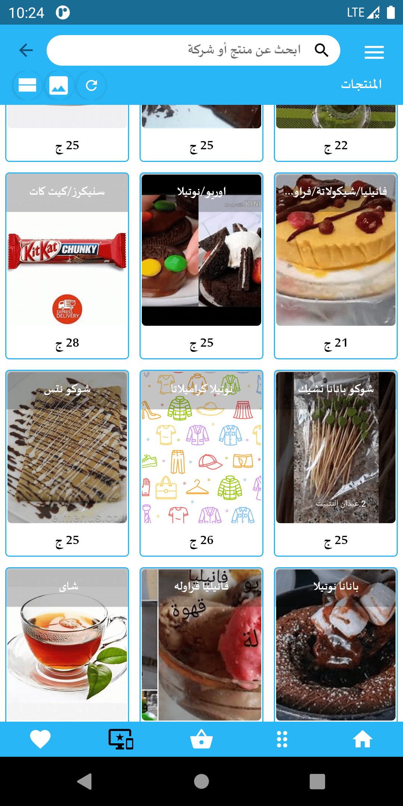
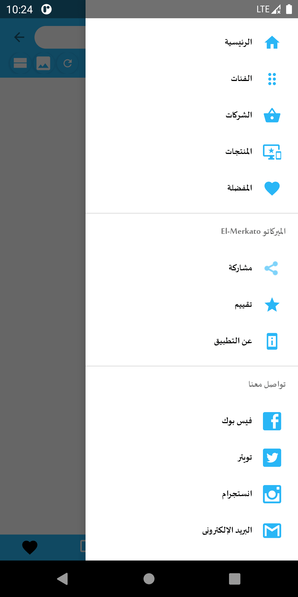
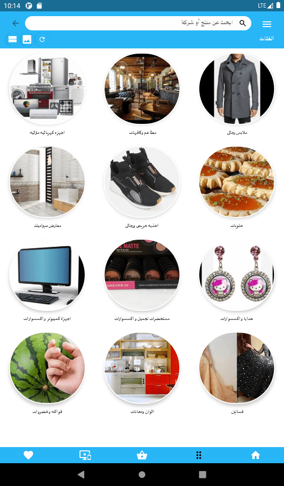
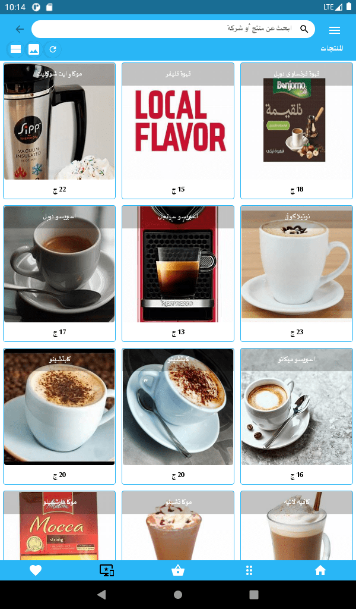
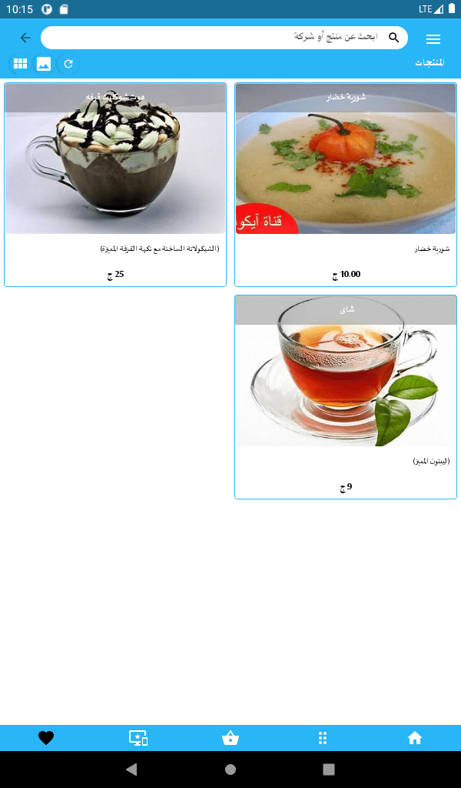
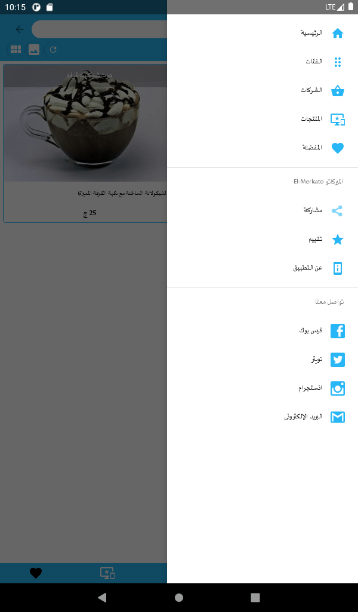

  

# El-Merkato الميركاتو 
Online Shopping Store  متجر للتسوق الإلكتروني

 <h3>Mobile View</h3>
 
  

  
  
  

 

  
  
  

 
 
 <h3>Tablet View</h3>
 
 

  
  
  

 

  
  
  

 

  
### Technologies:
<li>Java</li>
<li>MVVM architecture</li>
<li>Data Binding and Live Data</li>
<li>Dagger 2</li>
<li>Room Database</li>
<li>Realtime database</li>
<li>Material components</li>

### Third parties:
- Glide
- PhotoView

### more..
- Python used for scrappig prducts from yahoo images.

 
[Download](https://play.google.com/store/apps/details?id=com.ma7moud3ly.elmerkato)

